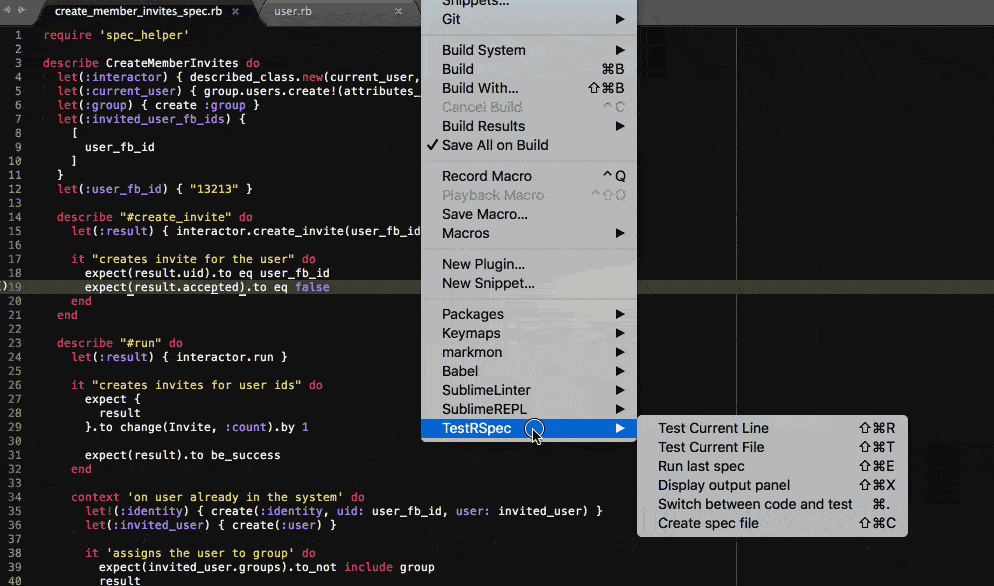

# Sublime RSpec

THIS IS WIP, please do not use it!!!

RSpec plugin for Sublime Text 3

Run, navigate and create specs from Sublime editor.



## Motivation

I have used [RubyTest](https://github.com/maltize/sublime-text-2-ruby-tests)
plugin for some time and was not happy with it.

So I decided to create a simple to understand and develop plugin targeting only `rspec`.

## Output

Executed using sublime build tools `exec` command.

When preconditions are not satisfied outputs to panel.

## Configuration

[Read this](http://www.granneman.com/webdev/editors/sublime-text/configuring-sublime-text/)
if you want to know how Sublime package settings work.

Find settings in "Preferences -> Package Settings -> TestRSpec"

[Default settings](https://github.com/astrauka/TestRSpec/blob/master/TestRSpec.sublime-settings)

## Key bindings

Find bindings in "Preferences -> Package Settings -> TestRSpec"

[Default bindings](https://github.com/astrauka/TestRSpec/blob/master/Default.sublime-keymap)

## Features

### Run rspec

Executes Sublime command to run rspec.
Displays output in panel.

Launch rspec for:
* current line
* current file
* run previous spec

Command generation

```
# output example
# /home/user/.rbenv/bin/rbenv exec bundle exec spring rspec /home/user/dev/project/spec/models/user_spec.rb:2
#
# ProjectRoot
#   project root by ../spec
#
# SpecTarget
#   file + line
#
# Rspec
#   Environment variables
#     take from configuration
#
#   (BinRspec || RubyRspec) + SpecTarget
#
#   BinRspec
#     find /bin/rspec from project root
#
#   on ./bin/rspec not found
#     RubyRspec : (Rbenv || Rvm || SystemRuby) + Bundle + Spring
#       Rbenv on configuration
#         find $HOME/.rbenv/bin/rbenv exec
#
#       Bundle on configuration
#         check if Gemfile is present
#         bundle exec
#
#       Spring on configuration
#         check if Gemfile contains spring
#         spring
```

### Switch between code and test

Returns all matches by file name.
Prioritizes matches by path as they are more likely the right ones.

### Create spec file

Creates spec file when launched in source file.

Uses code snippet defined in settings.

## TODO

- [ ] release package

## Acknowledgments

Inspired by https://github.com/maltize/sublime-text-2-ruby-tests

Parts that are taken:
* test console theme
* key bindings
* idea of how to switch between code and test
* idea of how to run spec

## Contribution

Help is always welcome. Create an issue is you need help.

### Sublime Text plugin development links

* [Create plugin](https://clarknikdelpowell.com/blog/creating-sublime-text-3-plugins-part-1/)
* [Submit package](https://packagecontrol.io/docs/submitting_a_package)
* [Forum](https://forum.sublimetext.com/c/technical-support)
* [Documentation](https://www.sublimetext.com/docs/3/)
* [Api reference](https://www.sublimetext.com/docs/3/api_reference.html)
* [Auto reloading](https://forum.sublimetext.com/t/auto-reloading-of-python-module-files-used-by-plugin/5321/7)
* [Extract package](https://github.com/SublimeText/ExtractSublimePackage) -
`view.execute_command("extract_single_package_file", "Default")` to extract default package and understand plugin development basics
* [Package settings](https://www.sublimetext.com/docs/3/packages.html)
* [Unofficial documentation](http://docs.sublimetext.info/en/latest/index.html)

## Changelog

### v1.0.0

* Initial release

## Copyright and license

Copyright © 2016 [@astrauka](http://twitter.com/astrauka)

Licensed under the [**MIT**](http://miro.mit-license.org) license.
